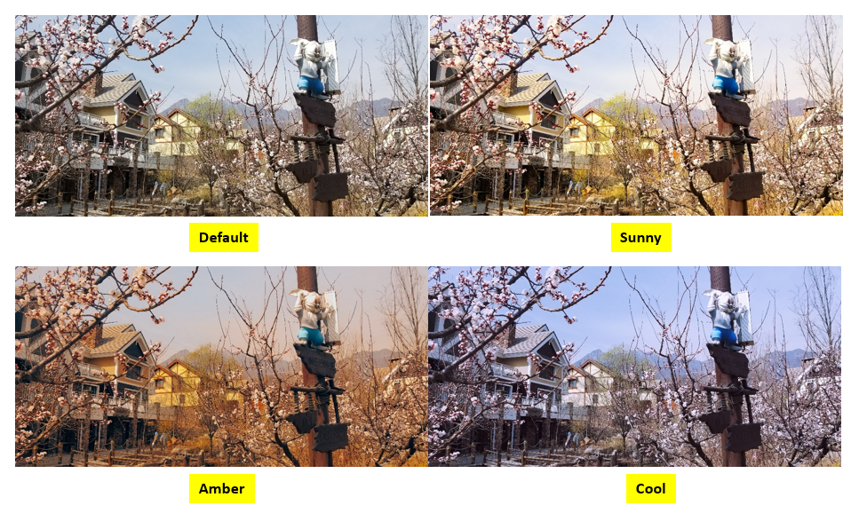

## Introduction
    Java sample code of the HUAWEI Video Engine provides many sample programs for your reference or usage.
    The following describes packages of Java sample code.
    
    com/huawei/hivideokitdemo:           Sample code packages
	[Read more about Video Engine](https://developer.huawei.com/consumer/en/hms/huawei-videoengine)

## Installation
    Before using Java sample code, check whether the Java environment has been installed. 
    Decompress the Java sample code package.
    
    Copy the videoengine-java-sample package in the decompressed folder to the project vendor directory in the path specified by JAVAPATH.
    Refresh the project and ensure that the file is successfully copied to the destination directory.
    
## Supported Environments
	Java 1.8 or a later version is recommended.
	
## Configuration 
    To use functions provided by packages in examples, you need to download Video Engine SDK and put it in the libs folder.
	[Add Video Engine to your Android Project](https://developer.huawei.com/consumer/en/doc/development/Media-Guides/preparations-0000001058740907 ).
	Run the sample on Android device or emulator.
	
## Sample Code
    Java sample code uses the Client structure in the package as the entry. Each method in the Client structure calls an API of the HUAWEI Video Engine server.
    The following describes methods in the Client structure.

    1). version().
	You can check whether the pre-installed cinematic color engine APK on the device is compatible with the SDK version.
    Code location£ºcom/huawei/hivideokitdemo/MainActivity.java
    
    2). feature().
    You can check whether the current mobile phone supports the cinematic color feature.
    Code location£ºcom/huawei/hivideokitdemo/MainActivity.java
    
    3). go().
    You can skip to SecActivity.
    Code location£ºcom/huawei/hivideokitdemo/MainActivity.java
    
    4). apply().
    You can set the preset filter effect.
    Code location£ºcom/huawei/hivideokitdemo/MainActivity.java
    
    5). apply3d().
    You can set the custom filter effect.
    Code location£ºcom/huawei/hivideokitdemo/MainActivity.java
    
    6). stopEffect().
    You can disable the filter effect.
    Code location£ºcom/huawei/hivideokitdemo/MainActivity.java

## Result
	
	
##  License
    Video Engine Java sample is licensed under the [Apache License, version 2.0](http://www.apache.org/licenses/LICENSE-2.0).

